## TOPICOS ESPECIAIS EM INFORMATICA 
## SISTEMA ACADEMICO 

Grupo 8: Isabella Cruz de Oliveira, Rafaela Cristina Santos, Victor Principe dos Santos 

Essa API foi desenvolvida em Node com Express, e utilizando o Prisma para montar o Schema do banco de dados. 
Foi desenvolvido um CRUD de Provas, que corresponde a: Para cada turma (ver definição de turma acima), o
professor planeja as datas das provas e entrega de trabalhos. Desenvolver CRUD para manter estes itens. 
Deverão ser registrados os conteúdos a serem avaliados nas provas e os enunciados dos trabalhos.

## MY SQL

No desenvolvimento desse CRUD foi usado o Banco de Dados MySql, assim usamos os comandos: 
                    create database sistemaacademico
                        use sistemaacademico

                            show tables

                        // precisamos preencher algumas tabelas para que seja possível fazer o agendamento das provas
                            SELECT * FROM PROFESSORES
                            INSERT INTO PROFESSORES (nome, lattes, telefone, email) 
                            VALUES ("Paulo Cândido", "???", "123123123", "paulo.candido@fatec.sp.gov.br");
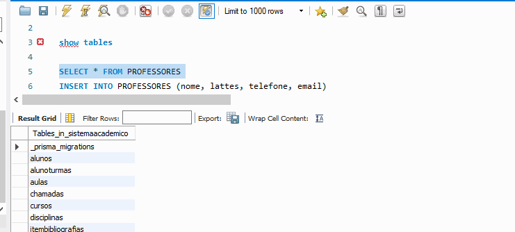

                            SELECT * FROM CURSOS
                            INSERT INTO CURSOS (nome, descricao, professorId) 
                            VALUES ("Analise e Desenvolvimento de Sistemas", "ads", 2);
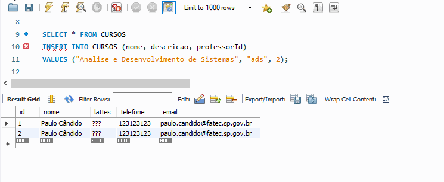

                            SELECT * FROM ALUNOS
                            INSERT INTO ALUNOS (nome, cursoId, telefone, email, dataNascimento) 
                            VALUES ("Isabella", 1, "123123123", "isabella.oliveira@fatec.sp.gov.br", '2004-04-12');
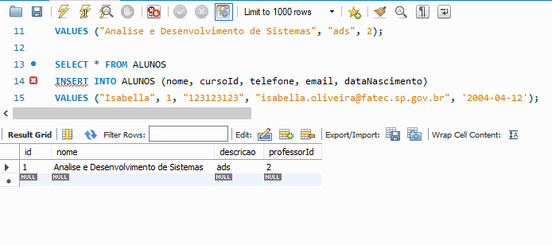
                            
                            SELECT * FROM SALAAULAS
                            INSERT INTO SALAAULAS (tipo, temProjetor, bloco, quantidadeCadeiras, quantidadeComputadores) 
                            VALUES ("Laboratorio", 1, "bloco 1", 29, 12);
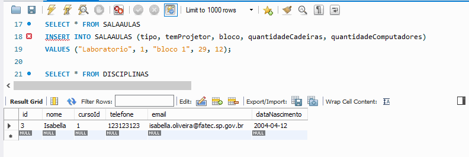

                            SELECT * FROM DISCIPLINAS
                            INSERT INTO DISCIPLINAS (nome, ementa, cargaHoraria) 
                            VALUES ("Topicos de Informatica", "ementa", 12);
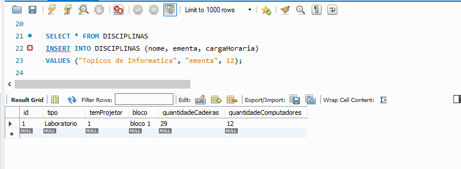

                            SELECT * FROM SEMESTRES
                            INSERT INTO SEMESTRES (descricao, sigla) 
                            VALUES ("Semestre 1", "1S");
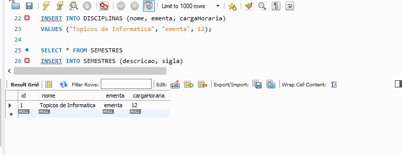

                            SELECT * FROM TURMAS
                            INSERT INTO TURMAS (cursoId, salaAulaId, professorId, disciplinaId, semestreId) 
                            VALUES (1, 1, 1, 1, 1 );
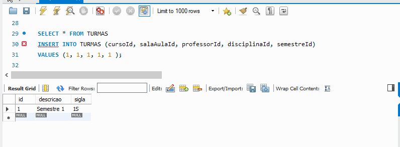

                            SELECT * FROM PROVAS
                            INSERT INTO PROVAS (dataProgramada, tipo, peso, turmaId) 
                            VALUES ('2022-05-05', "Presencial", 9, 1);

# CRUD 
Usaremos o POSTMAN para testar o CRUD: 

### POST 

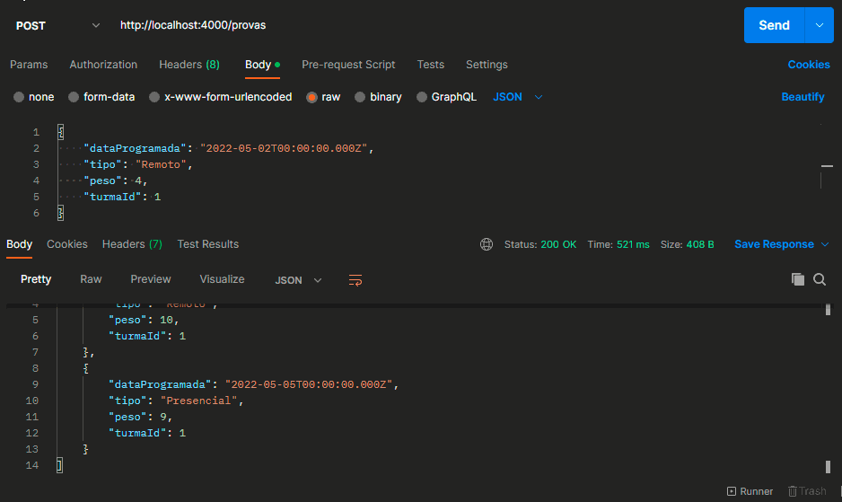

### GET 

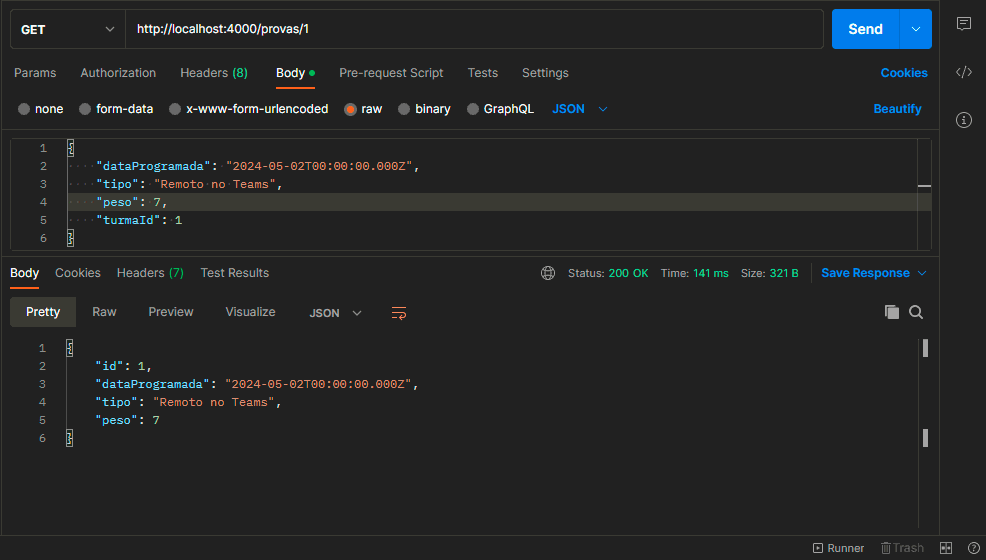

### GET ID  

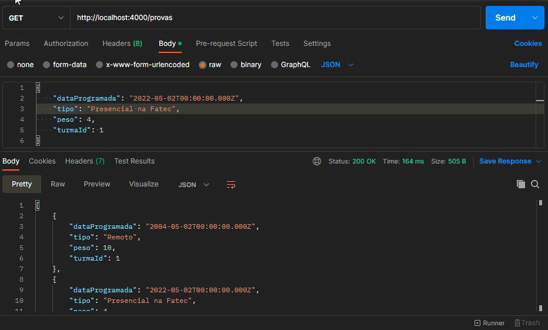

### PUT 

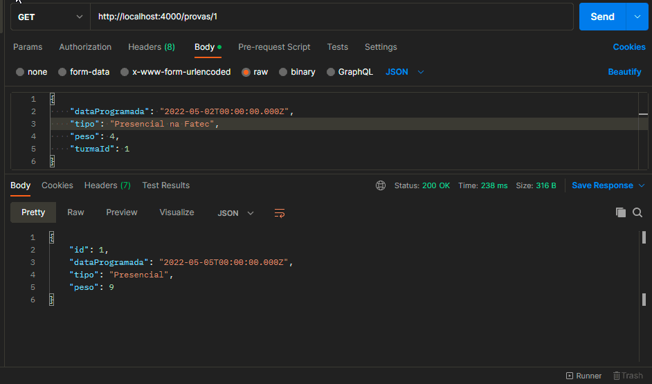

### DELETE 

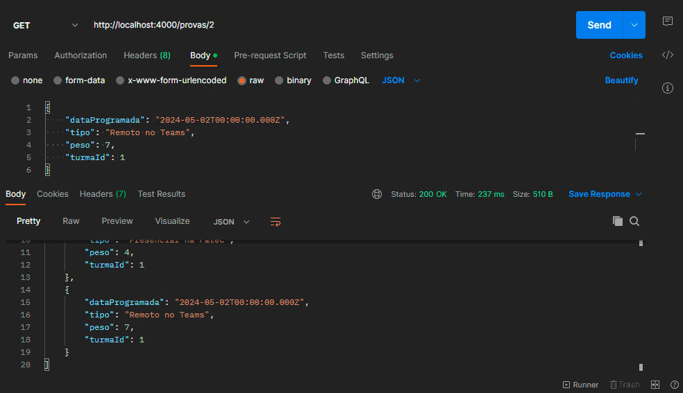

